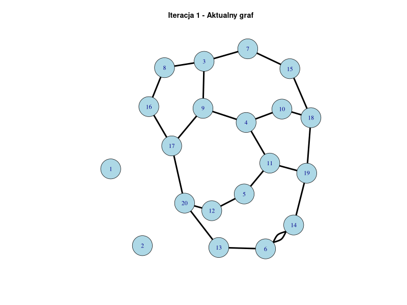

## Spis treści

- 1. Weryfikacja obecności cyklu C3

    - 1.1 Naiwny algorytm

    - 1.2 Podniesienie macierzy M do M^3

- 2. Algorytm 2-przybliżony dla problemu Vertex Cover

- 3. Algorytm 2-przybliżony dla drzewa Steinera

- 4. Algorytm Christofidesa

- 5. Metoda ścieżki krytycznej (CPM)

---

## 1. Weryfikacja obecności cyklu C3

Cykl C3 to cykl trójelementowy, czyli trójkąt w grafie. Implementacja obejmuje dwa podejścia do znalezienia takiego cyklu.

### 1.1 Naiwny algorytm

Naiwny algorytm przechodzi przez wszystkie wierzchołki i sprawdza, czy istnieją trójelementowe cykle.

- Złożoność obliczeniowa: $O(n^3)$

- Implementacja iteruje przez wszystkie kombinacje trzech wierzchołków i sprawdza ich połączenia.

### 1.2 Podniesienie macierzy M do M^3

Drugie podejście polega na podniesieniu macierzy sąsiedztwa do potęgi trzeciej i sprawdzeniu, czy wzdłuż przekątnej wynikowej macierzy są elementy niezerowe.

- Złożoność obliczeniowa: $O(n^3)$

 **Przykładowe działanie:**

---

## 2. Algorytm 2-przybliżony dla problemu Vertex Cover

Algorytm polega na iteracyjnym usuwaniu pierwszej napotkanej krawędzi oraz wszystkich incydentnych do niej wierzchołków, co skutkuje pokryciem wierzchołkowym.

- Złożoność obliczeniowa: $O(n + m)$

- Zapewnia wynik nie gorszy niż dwukrotność optymalnego pokrycia.

 **Przykładowe działanie:**
.gif)

---

## 3. Algorytm 2-przybliżony dla drzewa Steinera

Algorytm Kou, Markovsky'ego i Bermana znajduje przybliżone minimalne drzewo Steiner'a dla podanego zbioru terminali.

- Wykorzystuje algorytm MST (Minimum Spanning Tree), a następnie przekształca wynik, aby uzyskać podzbiorowe drzewo Steiner'a.

- Złożoność: $O(n^2)$ dla grafów rządu  $n$.

- Zapewnia 2-przybliżone rozwiązanie optymalnego drzewa.

 **Przykładowe działanie:**

---

## 4. Algorytm Christofidesa

Algorytm Christofidesa znajduje minimalny cykl Hamiltona dla grafu spełniającego nierówność trójkąta.

- Algorytm:

    1. Oblicza minimalne drzewo rozpinające (MST).

    2. Znajduje minimalne doskonałe skojarzenie dla wierzchołków o nieparzystym stopniu.

    3. Łączy uzyskane elementy w cykl Hamiltona.

- Zapewnia 1.5-przybliżone rozwiązanie.

- Złożoność: $O(n^3)$.
 **Przykładowe działanie:**

---

## 5. Metoda ścieżki krytycznej (CPM)

Metoda Critical Path Method (CPM) służy do harmonogramowania projektów poprzez znalezienie najdłuższej ścieżki w grafie zadań.

- Wejście: Graf skierowany, gdzie wierzchołki to zadania, a krawędzie określają zależności.

- Wyjście: Ścieżka krytyczna oraz minimalny czas ukończenia projektu.

- Złożoność: $O(n + m)$ dla zadań $n$ i zależności $m$.
 **Przykładowe działanie:**
- 

# Technologie

- Rust

- R z biblioteką igraph

- C++ z biblioteką Boost
